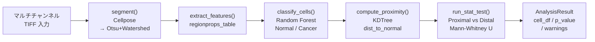

# Tissue Spatial Analysis

蛍光組織切片画像における、がん細胞-正常細胞の空間近接度とバイオマーカー発現の統計解析ツール。

## 解決した課題

蛍光多重染色した組織切片を手動で観察する場合、「がん細胞が正常細胞の近くにあるか遠くにあるかで、バイオマーカー発現量が変わるか」という問いに定量的に答えることが難しかった。本ツールは画像のアップロードから統計検定まで全工程をワンクリックで完結させ、p値と可視化パネルをその場で取得できるようにした。実験系研究者がPythonコードを書かずにパラメータ調整と再解析を繰り返せるよう、Streamlit UIを採用している。

## 主要機能

- **核セグメンテーション**: Cellposeによるディープラーニング細胞核検出（未インストール時はOtsu+Watershedで自動代替）
- **細胞特徴量定量化**: `skimage.measure.regionprops_table` による面積・形状・チャンネル別輝度の一括抽出
- **Normal/Cancer 二値分類**: scikit-learn互換の学習済みRandomForestモデルによる予測（モデル未指定時はデモ分類）
- **空間近接度計算**: `scipy.spatial.KDTree` による O(n log n) 最近傍距離算出（がん細胞 → 最近傍正常細胞）
- **統計検定**: Proximal/Distal群のバイオマーカー発現量比較をMann-Whitney U検定（両側）で実施し、p値を出力

## 技術スタック

| カテゴリ | 使用技術 |
|---|---|
| セグメンテーション | Cellpose 3.x（DL核検出）/ scikit-image Otsu+Watershed（フォールバック） |
| 画像処理 / ML | scikit-image `regionprops_table`、scikit-learn RandomForest、joblib |
| 統計・空間計算 | SciPy `KDTree`、`mannwhitneyu`（両側検定） |
| 可視化 | Matplotlib、Seaborn（散布図・ボックスプロット・距離ヒストグラム） |
| UI | Streamlit（ファイルアップロード、サイドバーパラメータ、session_state管理） |
| インフラ / デプロイ | Streamlit Cloud（GPU不要環境向け `requirements.txt` / WSL+GPU向け `requirements-local.txt`） |

## アーキテクチャ



3レイヤー構成：

| ファイル | 役割 |
|---|---|
| `config.py` | 全定数・デフォルト値を `@dataclass` で集約（`CellposeConfig` / `AnalysisConfig` / `VisualizationConfig`） |
| `spatial_analysis_tool.py` | `SpatialAnalyzer` クラス — 純粋な解析エンジン（UI依存ゼロ） |
| `app.py` | Streamlit UI、可視化関数、session_state 管理 |

## 使用方法

### セットアップ

```bash
# Streamlit Cloud / GPU不使用環境
pip install -r requirements.txt

# ローカル WSL / GPU使用環境（Cellpose含む）
pip install -r requirements-local.txt

# アプリ起動
streamlit run app.py
```

### デモモード（モデル・画像不要）

1. サイドバーの **「合成データでデモ実行」** をON
2. **Run Analysis** をクリック
3. 120細胞の合成データで全パイプラインの動作を確認できます（p < 0.05 が期待値）

### 実データ解析

1. サイドバーから学習済みモデル（`.joblib`）をアップロード
2. 組織画像（`.tif`、マルチチャンネル）をアップロード
3. **Proximity Threshold**（距離閾値・px単位）を調整
4. **Run Analysis** をクリック

### テストデータの生成

```bash
python generate_test_data.py
# → data/test_tissue_image.tif (4ch, 512×512)
# → data/test_model.joblib
```

## 設計上の工夫

**Graceful Degradation**
依存ライブラリの有無をimport時に検出し、`SpatialAnalyzer._warnings` に追記しながらフォールバックを継続する。Cellpose未インストール → Otsu+Watershed、GPU初期化失敗 → CPU自動切替、モデル未ロード → ランダム分類（seed固定）、バイオマーカー列不一致 → 利用可能な末尾channelを自動選択。

**Demo mode の設計**
`app.py:generate_demo_data()` はセグメンテーションと特徴量抽出を完全スキップし、DataFrameを直接合成して `compute_proximity` と `run_stat_test` のみを呼び出す。セグメンテーションに依存せずUIの動作確認とデプロイ検証を可能にしている。

**Dataclass による設定一元管理**
`CellposeConfig` / `AnalysisConfig` / `VisualizationConfig` の3つのdataclassに全定数を集約し、マジックナンバーをコード中に散在させない。UIのスライダー範囲（`proximity_threshold_min/max`）も同じdataclassから参照する。

**session_state によるステートフルUI**
解析結果を `st.session_state.result` に保持することで、パラメータ変更後のUI再描画時に不要な再解析を防止する。デモモードのON/OFFフラグも同様に管理している。

**純粋解析エンジン分離**
`SpatialAnalyzer` はStreamlitを一切importせず、`AnalysisResult` dataclassを返すだけ。UIフレームワークの差し替えやCLI化・ユニットテスト化が可能な構造になっている。

## 今後の拡張可能性

- **マルチクラス分類対応**: `classify_cells()` の出力を多値ラベルに拡張し、複数の細胞サブタイプの空間パターンを比較
- **3D組織スタック対応**: `_to_chw()` の軸判定を `(C, Z, H, W)` に拡張し、confocal Zスタック画像に対応
- **バッチ解析モード**: `run_pipeline()` をCLIラッパーから呼び出し、複数スライドの一括処理とCSV集計を自動化

## ライセンス

MIT License
